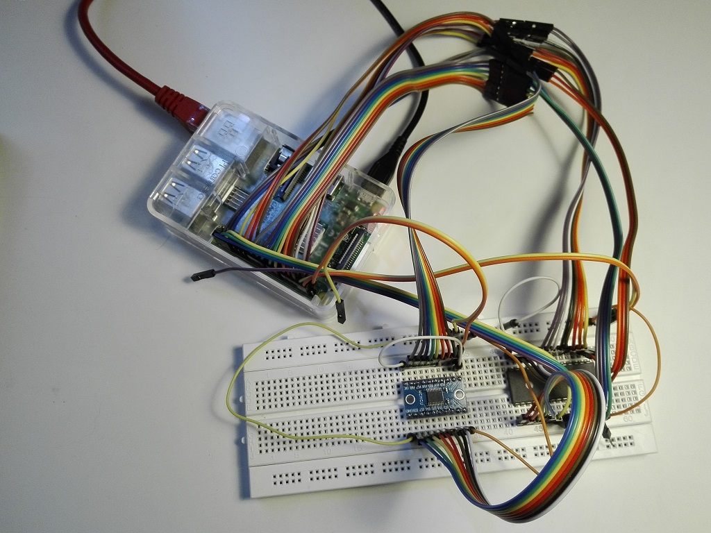
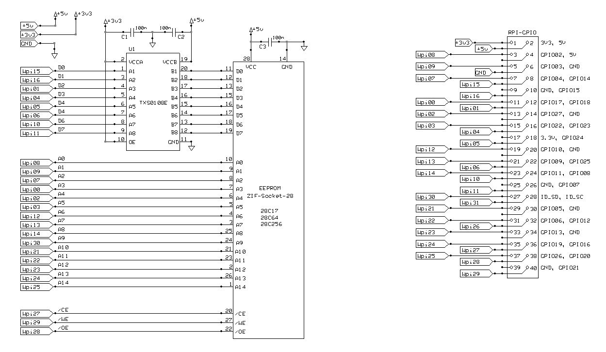
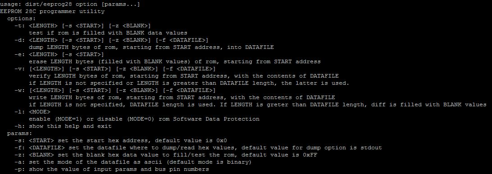

 # EEPROM 28C Programmer
**Type**: Hosted Project | **Status**: Completed

This is a home project for a simple parallel EEPROM programmer based on Raspberry PI (model 3).

It currently supports 28C16 (2Kx8), 28C64 (8Kx8) and 28C256 (32Kx8) EEPROMs, but it will probably work with all 28C-family (having all the necessary address-bus pins).

## Specifications

The hardware uses a standard Raspberry Pi 3 for its abundant GPIOs, avoiding the complexity of serial-to-parallel shift registers on the address bus.

* **Voltage Translation:** The voltage gap between the Raspberry Pi GPIOs (3.3V) and the EEPROM pins (5V) is safely managed by a TXS0108 8-bit bidirectional voltage-level translator.

* **Timing Management:** The C software currently supports single-byte operations; write cycles are managed through hard-coded delays to guarantee completion.

### Prerequisites / Requirements

To build and run this project:

* **Hardware:** Raspberry Pi Model 3 (or any model with enough available GPIOs), TXS0108 translator.

* **Software:** WiringPI library installed, standard GCC toolchain.

### Hardware

Schematics and PCB layouts are designed with ExpressPCB free CAD software.

#### Schematic:

### Software

The software is written in C and uses WiringPI for GPIO access, and the GNU Getopt function to automate the parsing of command-line options.

Below is the list of options with the relative allowed params, as shown in the help:

***Warn!** The software, in this release, does not check the value of the parameters, be careful.*

## Changes

See file [CHANGES](CHANGES.md) for the project resources change logs

## Future Plans

See file [TODO](TODO.md) for the project future plans

## About & License

**Author**: Alessandro Fraschetti (gom9000). 
**Technical Notes**: The hardware design was supported by **ExpressPCB** and the custom **[expresspcb-goslib](https://github.com/gom9000/expresspcb-goslib)** libraries. 
**License**: This project is licensed under the [MIT License](LICENSE). 