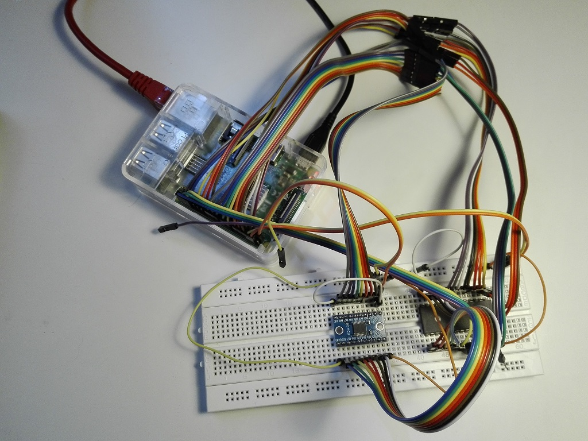

# EEPROM 28C Programmer eXPerience
This is a home project for a simple parallel EEPROM programmer based on Raspberry PI (model 3).
It currently supports 28C256 (32Kx8) and 28C64 (2Kx8) EEPROMs, but it will probably work with all 28C-family.

## Specifications
The need of model 3 of Raspberry is only for the number of usable GPIOs
(but it may be possible to save a lot of pins using serial-to-parallel shift registers for the address bus).
The different voltages between Raspberry GPIOs (3.3V) and EEPROM pin (5V) is managed by a TXS0108 (8-bit bidirectional voltage-level translator).
The software currently supports single-byte reads/writes, write operation is followed by hard-coded delay to complete a write cycle.

### Hardware
Schematics and PCB layouts are designed with ExpressPCB free CAD software.

#### Schematic:

### Software
The software is written in C and uses WiringPI for GPIO access, and the GNU Getopt function to automate the parsing of command-line options.

Compile with:
	gcc eeprog28.c -o eeprog28 -lwiringPi

Below is the list of options with the relative allowed params, as shown in the help:

Warn! The software, in this release, does not check the value of the parameters, be careful.

## Changes
See file [CHANGES](CHANGES.md) for the project resources change logs

## Future Plans
See file [TODO](TODO.md) for the project future plans

## About
Author : Alessandro Fraschetti (mail: [gos95@gommagomma.net](mailto:gos95@gommagomma.net))

## License
This project is licensed under the [MIT license](LICENSE)